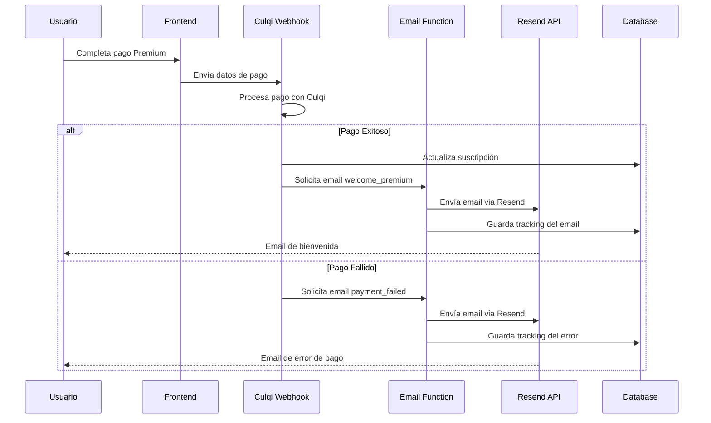

# Sistema de Notificaciones por Email - Guía de Configuración

## 🎯 Resumen
Sistema automatizado de notificaciones por email para MisFinanzas que envía emails cuando:
1. **Usuario se registra como Premium** → Email de bienvenida
2. **Falla el cobro de tarjeta** → Email de notificación y solución

## 📋 Requisitos Previos

### 1. Cuenta Resend (Proveedor de Email)
- Ir a [resend.com](https://resend.com) y crear cuenta
- Obtener API Key en la sección "API Keys"
- **Costo:** $20/mes por 10,000 emails (plan inicial)

### 2. Configuración de Variables de Entorno
Agregar en Supabase Dashboard → Functions → Environment Variables:

```bash
RESEND_API_KEY=re_xxxxxxxxxxxx
RESEND_FROM_EMAIL=no-reply@misfinanzas.com
RESEND_FROM_NAME=MisFinanzas
EMAIL_BASE_URL=https://joseluisparedes.github.io/mis-finanzas
EMAIL_SUPPORT_EMAIL=soporte@misfinanzas.com
EMAIL_SUPPORT_PHONE=+51-XXX-XXX-XXX
```

## 🚀 Instalación Automatizada

### Método 1: Script de Deployment
```bash
# Configurar token de acceso
export SUPABASE_ACCESS_TOKEN=sbp_tu_token_aqui

# Ejecutar script automatizado
./scripts/deploy-email-system.sh
```

### Método 2: Deployment Manual

#### Paso 1: Aplicar Schema de Base de Datos
```sql
-- Ejecutar en Supabase SQL Editor
-- Contenido del archivo: database/email_notifications.sql
```

#### Paso 2: Deploy Edge Functions
```bash
# Deploy función de emails
supabase functions deploy send-email --project-ref aimfmouxduklejrejlcq

# Actualizar función de Culqi con emails
supabase functions deploy culqi-payment-webhook --project-ref aimfmouxduklejrejlcq
```

## 📧 Templates de Email Implementados

### 1. Bienvenida Premium
- **Trigger:** Pago exitoso completado
- **Template:** `welcome_premium`
- **Contenido:**
  - Mensaje personalizado de bienvenida
  - Lista de funciones Premium desbloqueadas
  - Enlaces directos a funciones principales
  - Información de soporte prioritario

### 2. Fallo de Pago
- **Trigger:** Error en procesamiento de pago
- **Template:** `payment_failed` 
- **Contenido:**
  - Explicación clara del error
  - Pasos específicos para solucionarlo
  - Botón para actualizar método de pago
  - Timeline antes de degradar a plan gratuito

## 🔧 Testing del Sistema

### Test 1: Email de Bienvenida Premium
```bash
# Hacer una compra Premium completa
# Verificar que llega el email de bienvenida
```

### Test 2: Email de Pago Fallido
```bash
# Usar tarjeta de prueba que falle
# Verificar que llega email de notificación
```

### Test 3: API Manual
```bash
curl -X POST \
  https://aimfmouxduklejrejlcq.supabase.co/functions/v1/send-email \
  -H "Authorization: Bearer tu_service_role_key" \
  -H "Content-Type: application/json" \
  -d '{
    "type": "welcome_premium",
    "user_id": "user-uuid-aqui",
    "recipient_email": "test@example.com",
    "template_data": {
      "user_name": "Usuario Test",
      "amount": "15"
    }
  }'
```

## 📊 Monitoreo y Analytics

### Dashboard de Métricas
- **URL:** Supabase Dashboard → Functions → Logs
- **Métricas disponibles:**
  - Emails enviados vs fallidos
  - Tasas de apertura (si se implementa pixel tracking)
  - Errores de delivery

### Consultas SQL de Análisis
```sql
-- Estadísticas generales de emails
SELECT * FROM get_email_stats('2025-01-01', '2025-12-31');

-- Emails enviados hoy
SELECT email_type, status, COUNT(*)
FROM email_notifications 
WHERE DATE(created_at) = CURRENT_DATE
GROUP BY email_type, status;

-- Usuarios sin email de bienvenida
SELECT us.user_id, us.subscription_type
FROM user_subscriptions us
LEFT JOIN email_notifications en ON us.user_id = en.user_id 
  AND en.email_type = 'welcome_premium'
WHERE us.subscription_type IN ('premium', 'premium_early_bird')
  AND en.id IS NULL;
```

## 🚨 Troubleshooting

### Error: "Missing RESEND_API_KEY"
**Solución:** Configurar API Key en Environment Variables de Supabase

### Error: "Failed to send email"
**Posibles causas:**
1. API Key inválida o expirada
2. Límite de envío alcanzado
3. Email bloqueado por spam filters

### Error: "User not found"
**Solución:** Verificar que el user_id existe en auth.users

### Emails no llegan
**Verificaciones:**
1. Revisar carpeta de spam
2. Verificar logs en Supabase Functions
3. Confirmar configuración DNS si usas dominio propio

## 🔄 Flujo Técnico Completo



## 📈 Próximas Mejoras

### Funcionalidades Futuras
- [ ] Email de renovación próxima (7 días antes)
- [ ] Email de re-engagement (usuarios inactivos)
- [ ] Email de nuevas funcionalidades Premium
- [ ] A/B testing de subject lines
- [ ] Pixel tracking para métricas de apertura

### Optimizaciones
- [ ] Queue system para envíos masivos
- [ ] Retry automático con backoff
- [ ] Templates más sofisticados con React Email
- [ ] Segmentación por tipo de usuario

## 💡 Best Practices

### Deliverability
- Usar dominio propio verificado
- Implementar SPF, DKIM, DMARC
- Mantener lista de emails limpia
- Monitorear reputation del dominio

### Content
- Subject lines claros y específicos
- CTAs prominentes y específicos
- Responsive design para móviles
- Texto alternativo para imágenes

### Analytics
- Trackear todas las métricas importantes
- Segmentar por tipo de email
- Monitorear trends de engagement
- Optimizar basado en datos

## 🎉 Conclusión

El sistema de notificaciones por email está completamente implementado y listo para mejorar la experiencia del usuario en MisFinanzas. Con templates profesionales, tracking completo y integración automática con el sistema de pagos, los usuarios recibirán comunicación oportuna y efectiva sobre el estado de sus suscripciones.

**Próximo paso:** Configurar Resend API Key y hacer el primer test de pago para verificar funcionamiento completo.